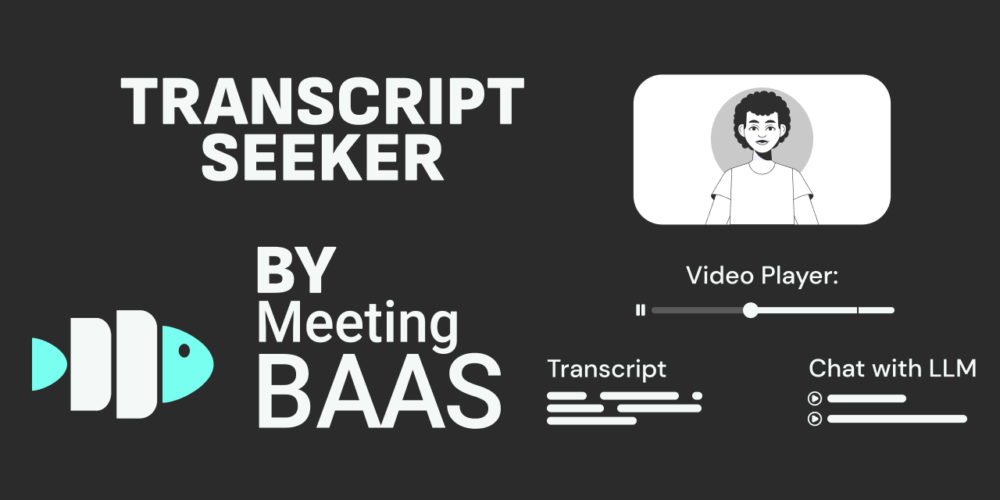

# Transcript Seeker



## Overview

Open-source transcription playground powered by transcription APIs and meeting bot API technology. <br/>
Upload and store recordings, or use our meeting bot transcription API to record Google Meet, Microsoft Teams and Zoom: <br/>

- Transcribe recordings with our meeting transcription API.
- Chat with transcripts using LLMs.
- Annotate recordings.
- And more.

Running directly in your browser using [IndexedDB](https://developer.mozilla.org/en-US/docs/Web/API/IndexedDB_API).

## Key Features

- Upload video/audio recordings, transcribe them using our meeting transcription API
- Get a transcript synced to your recording. Click on a word to jump through the recording.
- Generate recordings with meta-data on Zoom, Google Meet, Teams, using [Meeting Baas' 🐟](https://meetingbaas.com) meeting bot API.
- Chat with transcripts via OpenAI
- Add notes to recordings, or automatically add AI summaries of transcripts as a note, as soon as you upload a file.
- Standalone mode with browser Local Storage

## Tech Stack

- Frontend: React, TypeScript, TailwindCSS
- Media Playback: Vidstack
- Backend: Meeting bot transcription API

## Quick Start

1. Clone the repo:

   ```
   git clone https://github.com/Meeting-Baas/transcript-seeker && cd transcript-seeker
   ```

2. Install dependencies:

   ```
   yarn install && yarn install:all
   ```

3. Build dependencies:

   ```
   yarn run build
   ```

4. Copy the .env.example to .env

   ```
   cp .env.example .env
   ```

5. Run using just the front-end, without adding variables in .env necessary for now:
   ```
   cd client && yarn run dev
   ```

## Contributing

Open a PR. Looking for ideas? Checkout the [to-do list](./TODO.md)

## License

MIT License

## Support

Open an issue or join our [Discord](https://discord.com/invite/dsvFgDTr6c).

## Acknowledgements

- [Meeting Baas API](https://meetingbaas.com/) - Our meeting bot API and meeting transcription API provider
- [Vidstack](https://www.vidstack.io/)
