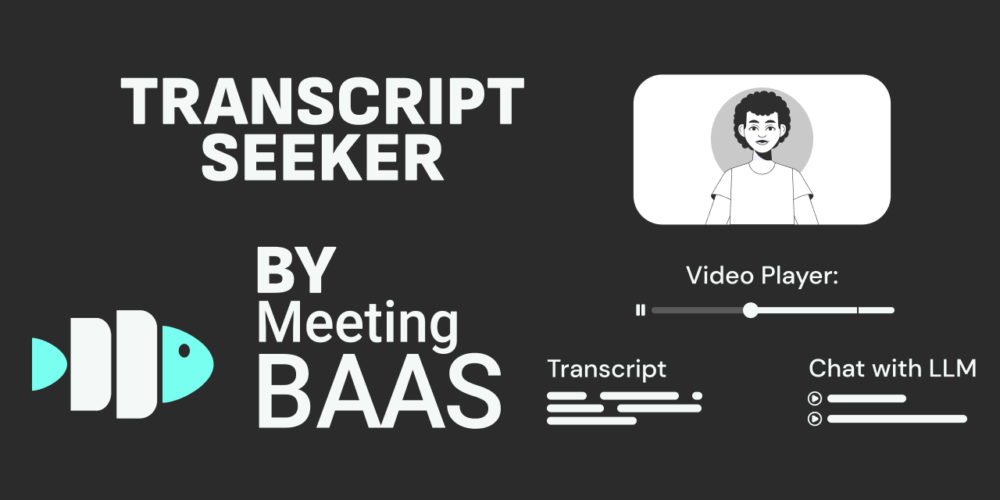

# Transcript Seeker



## Overview

**Transcript Seeker** is an open-source transcription playground powered by transcription APIs and meeting bot technology. With this app, you can easily upload and store recordings, transcribe them, chat with transcripts, generate notes, and more—all directly in your browser.

### Key Features

- **Upload and Transcribe**: Upload video or audio recordings and transcribe them.
- **Interactive Transcripts**: Get transcripts synced with your recordings—click on a word to jump directly to that point in the recording.
- **Meeting Bot Integration**: Join, record, and create transcriptions from Zoom, Google Meet, and Microsoft Teams using [Meeting Baas' 🐟](https://meetingbaas.com) API.
- **Chat and Summarize**: Chat with your transcripts via OpenAI, or automatically generate summaries.
- **Add Notes**: Create custom notes or let AI add summaries to your recordings.

## Tech Stack

- **Frontend**: 
  - Framework: React, Vite.js
  - Language: TypeScript
  - Styling: TailwindCSS
  - UI Components: Radix UI
  - Data Fetching: SWR - A library for easy data fetching.
- **Media Playback**: Vidstack - provides seamless media playback capabilities.
- **Backend**: 
  - Proxy Server: Express (using Node Http Proxy)
  - API Integration: Meeting Baas for meeting recording and transcription.
- **Database**: 
  - Browser Database: PGLite - A lightweight Postgres implementation for browser-based data storage.
- **ORM**: Drizzle ORM - A developer-friendly ORM for efficient database operations.
- **Monorepo Management**: Turborepo - Used to manage and build multiple packages efficiently, allowing concurrent script execution and streamlined development.


## Quick Start
This project utilizes Turborepo for managing and building multiple packages efficiently. Turborepo allows you to run build commands and scripts concurrently, making the development process fast and streamlined.

1. **Clone the Repo**:
   ```sh
   npx create-turbo@latest -e https://github.com/Meeting-Baas/transcript-seeker
   ```

2. **Set Up Environment Variables**:
   ```sh
   cp .env.example .env
   ```

3. **Run the App** (front-end only for now, without configuring `.env`):
   ```sh
   pnpm run dev
   ```

   > **Note**: If `pnpm run dev` isn't working, try this instead:
   ```sh
   npm install turbo --global
   turbo dev
   ```

## Contributing

We welcome contributions from everyone! To get started:

1. **Read the [Contributing Guide](./CONTRIBUTING.md)**: This guide provides an overview of our contribution process and best practices.
2. **Find an Issue**: Check out our [to-do list](./TODO.md) or existing GitHub issues to find something you'd like to work on.
3. **Open a Pull Request (PR)**: Once you've made changes, open a PR so we can review and merge your work.

We value contributions of all kinds, whether it's fixing bugs, adding features, improving documentation, or providing feedback.

## License

This project is licensed under the [MIT License](./LICENSE). For more details, see the full license text.

You can also check out our [Contributing Guide](./CONTRIBUTING.md) if you'd like to get involved.

## Support

If you need help, feel free to open an issue or join our [Discord community](https://discord.com/invite/dsvFgDTr6c).

## Acknowledgements

- **[Meeting Baas API](https://meetingbaas.com/)** -  Meeting bot and transcription API provider.
- **[SWR](https://swr.vercel.app/)** - A React Hooks library for efficient remote data fetching.
- **[Turborepo](https://turborepo.org/)** - Used for managing and building multiple packages efficiently.
- **[Vidstack](https://www.vidstack.io/)** - UI components and hooks for building media players.
- **[PGLite](https://pglite.dev/)** - Postgres database for browser use, with reactivity and live sync.
- **[Drizzle ORM](https://orm.drizzle.team)** - An ORM to help ship your code faster and easier.

---

Thanks for checking out Transcript Seeker! Contributions, feedback, and suggestions are always appreciated.

